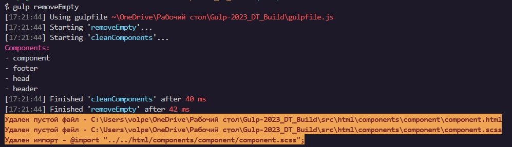

# Описание проекта

Этот проект - отличное решение для создания адаптивной и кроссбраузерной верстки с использованием Gulp, WebPack и Babel.

## Запуск проекта

Чтобы запустить проект, необходимо склонировать репозиторий с помощью команды `git clone`, установить зависимости с помощью `npm install`, а затем запустить сборщик с помощью команды `$ gulp`. В режиме "production" проект собирается с помощью **определенной** команды (<u>Подробнее см. раздел **Команды**</u>).

## Gulp

Gulp выполняет несколько важных задач для сборки проекта.
Он сжимает HTML и SCSS файлы, добавляет вендорные префиксы, конвертирует шрифты в .ttf и woff/woff2, сжимает изображения и создает "svg cпрайты", запускает сервер с автоматической перезагрузкой окна в браузере при изменении файлов в проекте.

Gulp также очищает папку с финальным проектом перед каждым запуском сборщика, чтобы не собирать мусор. Сборщик также может выгружать финальный проект на хостинг с помощью команды `$ npm run deployFTP`.
Настройки для ftp содержатся в файле `ftp.js` в папке `gulp/config/`

### WebPack

WebPack занимается обработкой файлов c JavaScript и позволяет модульное подключение скриптов. Он также позволяет писать код на ES6+ и сжимает файлы JS в режиме "production".

### Деплой

Для деплоя папки `/dist` на GitHub Pages можно использовать gh-pages. Деплой осуществляется по пути, указанному в `package.json` в поле `homepage`.

## :open_file_folder: Файловая структура

```
Poject
├── dist
│   ├── fonts
│   ├── styles
│   ├── images
│   ├── 404.html
│   ├── page.html
│   ├── index.html
├── gulp
│   ├── config
│   ├── tasks
├── src
│   ├── assets
│   │   ├── fonts
│   │   ├── images
│   ├── files
│   ├── styles
│   │   ├── js
│   │   │   ├── imports.js
│   │   │   ├── main.js
│   │   ├── scss
│   │   │   ├── config
│   │   │   │   ├── base
│   │   │   │   │   ├── _fonts.scss
│   │   │   │   │   ├── components.scss
│   │   │   │   ├── helpers
│   │   │   │   │   ├── _functions.scss
│   │   │   │   │   ├── _mixins.scss
│   │   │   │   │   ├── _variables.scss
│   │   │   │   ├── libs
│   │   │   │   │   ├── _flexframework.scss
│   │   │   │   │   ├── _reset.scss
│   │   │   │   │   ├── iconfont.scss
│   │   │   ├── sections
│   │   │   │   │   ├── section.scss
│   │   │   ├── main.scss
│   ├── html
│   │   ├── components
│   │   │   ├── component
│   │   │   │   ├── component.html
│   │   │   │   ├── component.js
│   │   │   │   ├── component.scss
│   │   ├── sections
│   │   │   │   ├── section.html
│   │   ├── views
│   │   │   │   ├── 404.html
│   │   │   │   ├── newPage.html
│   ├── index.html
├── .babelrc
├── .gitignore
├── gulpfile.js
├── package-lick.json
├── package.json
├── README.md
└── webpack.config.js
```

### Описание файловой структуры:

- `dist` - папка, в которой находятся сгенерированные файлы после выполнения задач с помощью Gulp
- `gulp` - папка с конфигурацией задач Gulp, разделенной на config и tasks
- `src` - папка, в которой находятся исходные файлы проекта
- `assets` - папка, в которой находятся шрифты и изображения
- `files` - папка, в которой находятся другие файлы, такие как JSON-файлы \* или XML-файлы
- `styles` - папка, в которой находятся файлы стилей
- `js` - папка, в которой находятся файлы JavaScript, такие как imports.js и main.js
- `scss` - папка, в которой находятся файлы SCSS стилей, разделенных на конфигурационные, вспомогательные, библиотеки, разделы и основной файл main.scss
- `html` - папка, в которой находятся HTML-файлы, разделенные на компоненты, секции и другие страницы (views)
- `components` - папка, в которой находятся файлы HTML, JavaScript и SCSS для компонентов, таких как кнопки, формы и т.д.
- `sections` - папка, в которой находятся файлы HTML для секций, которые можно использовать для добавления компонентов с помощью gulp-file-include
- `views` - папка, в которой находятся HTML-файлы для страниц проекта, такие как 404.html и page.html
- `index.html` - основной HTML-файл проекта
- `.babelrc` - конфигурационный файл для Babel, который может использоваться для преобразования кода ECMAScript 2015+ в код, который может работать в браузерах
- `.gitignore` - файл, который говорит Git, какие файлы и папки должны быть проигнорированы при коммите изменений в репозиторий Git
- `gulpfile.js` - файл, в котором находятся задачи Gulp, их конфигурация и запуск

---

## Команды:

#### `gulp`

Запускает тестовый сервер для разработки проекта.

#### `gulp build`

Сборка для продакшн, стандартная:

- Минифицирует только css.
- Переносит изображения в папку images **без оптимизации**.

#### `gulp build --max`

Сборка для продакшн, максимальная:

- Минифицирует **css**, **html** и файлы изображений.
- Переносит изображения в папку **images**, **с оптимизацией**.
- Добавляет `.webp` изображения и встраивает их в html при помощи тега `<picture>`.

<span style="color:red">**Внимание!** Изображения сжимаются, но теряют качество.</span>

#### `gulp build --optimized`

Сборка для продакшн, оптимизированная:

- Минифицирует только css.
- Переносит изображения в папку images, **с оптимизацией**.

#### `gulp build --min`

Сборка для продакшн, минимальная:

- Минифицирует только css и html файлы. Всё остальное собирает без вмешательства.

#### `gulp create-component --name my-component`

Создание файлов компонента:

- Этот таск позволяет создавать новые компоненты для проекта. Для использования таска необходимо выполнить команду `gulp create-component --name my-component`, где **my-component** - имя компонента.

- Таск создает три файла: my-component.html, my-component.scss и my-component.js. Файлы будут созданы в директории `src/html/components/my-component`

- Все импорты теперь добавляются автоматически, scss файлы компонента добавляются в `base/components.scss`, а js файлы в `js/imports.js`

- Важно убедиться, что директория `src/html/components` уже существует, иначе таск не выполнится.

- Если имя компонента не будет указано при вызове команды, то будет выведено сообщение об ошибке "Component name is not provided!" и таск завершится без создания файлов.

#### `gulp removeEmpty`

- Удаляет пустые файлы и папки, из папки `components`

---

### Updates:

- Обновлены стили стартовой страницы + исправлены некоторые баги
- Добавлен ESLint и prettier
- Добавлена подсветка удалений и отдельная команда для чистки от пустых файлов и импортов
  

- Добавлено автоматическое удаление импортов из `imports.js` и `components.scss` при сборке версии для production
- Добавлено автоматическое удаление пустых папок из папки `components` при сборке версии для production
- Обновлено описание
